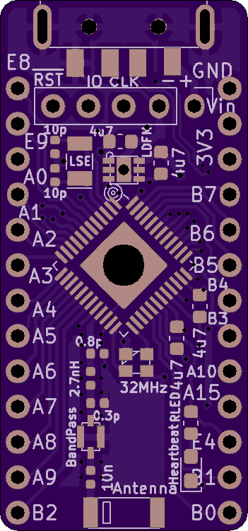
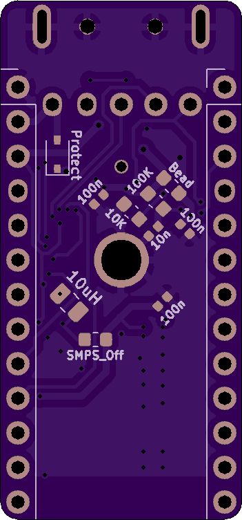

# STM32WB55 Example Board

**NOTE: I haven't had a chance to test this board much yet, so if you stumble across this, please wait a few weeks before trying to make one!** I'll update the repository with full gerber files and more information once I've checked that the radio/antenna/etc. work. It's my first RF design, so they might not.

I have received a first revision of the boards and verified that the microcontrollers can be programmed with a simple 'blinking LED' application, but I haven't tested any of the advanced peripherals such as USB or Bluetooth. Also, I think that I accidentally reversed the power pins on the USB connector footprint, so it's a good thing that I included a reverse polarity protection diode! That will be fixed shortly, but for now it is a reminder not to order one of these boards yet :)

I've been trying to do a better job of documenting the board designs that I make, so hopefully this can eventually grow into a useful reference design. In the meantime, sorry for the inconvenience and stay tuned.

# Board Renders

I tried to design this so that it could be soldered by hand if you don't have access to PCA services or a reflow station, but the small 0402 parts take a steady hand:

# Future Work

* Obviously, I need to write suitable firmwares to test the radio systems, USB communication, internal switching power supply, etc.

* Instead of using a separate bandpass filter and impedance-matching network, it might be easier to use an integrated filter chip which ST designed for these microcontrollers; part #MLPF-WB55-01E3. It only costs about $0.30, and it seems less error-prone than blindly using the pi filter values from the reference schematics.

* Adding an input button might be a good idea, to extend the range of potential applications.

* I should add a switch or jumper connected to the `BOOT0` pin, because it looks like it is only possible to change or update the co-processor's radio firmware in DFU mode. Fortunately, with the current design, you can remove the 10K resistor on the bottom of the board and solder a jumper between the `BOOT0` side of its pad and the `VDD` side of the 100K resistor which is right next to it. But that's not a good solution.

* Maybe I should move the `SWDIO`, `SWCLK`, and `NRST` pins to the two headers on either side of the board; it's unwieldy to have pin headers overhanging the USB plug.
