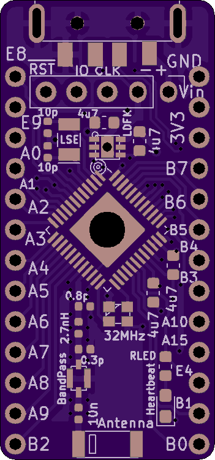
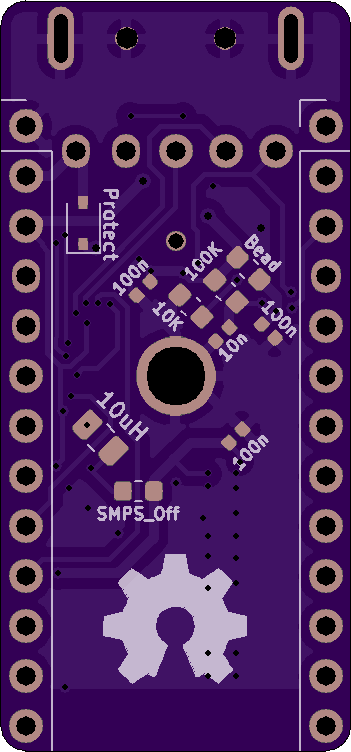

# STM32WB55 Example Board

**NOTE: I haven't had a chance to test this board much yet, so if you stumble across this, please wait a few weeks before trying to make one!** I'll update the repository with full gerber files and more information once I've checked that the radio/antenna/etc. work. It's my first RF design, so they might not.

I have received a first revision of the boards and verified that the microcontrollers can be programmed with a simple 'blinking LED' application, but I haven't tested any of the advanced peripherals such as USB or Bluetooth. Also, I think that I accidentally reversed the power pins on the USB connector footprint, so it's a good thing that I included a reverse polarity protection diode! That will be fixed shortly, but for now it is a reminder not to order one of these boards yet :)

I've been trying to do a better job of documenting the board designs that I make, so hopefully this can eventually grow into a useful reference design. In the meantime, sorry for the inconvenience and stay tuned.

# Board Renders

I tried to design this so that it could be soldered by hand if you don't have access to PCA services or a reflow station, but the small 0402 parts take a steady hand:

